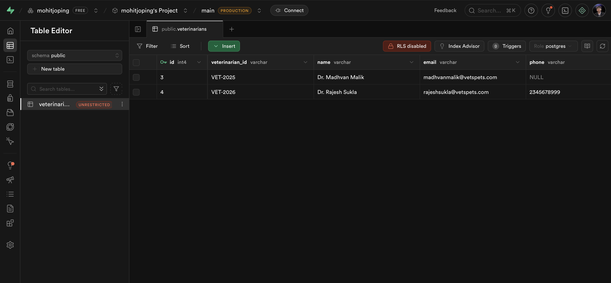
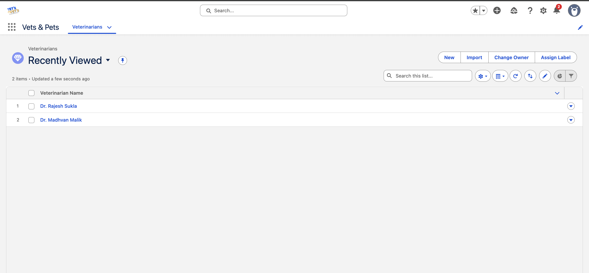
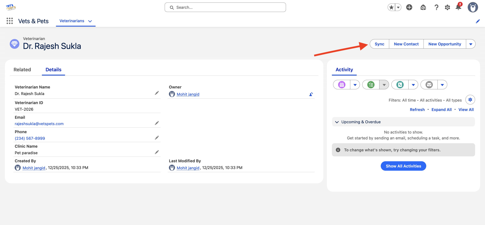

# Assignment overview

This assignment demonstrates how Salesforce can be integrated with an postgresDB using a REST API.

I have built:

* A **REST API** using **Node.js and Express.js**
* A **Salesforce Custom App** with:

  * Custom **LWC component (button)**
  * **Apex class** to handle server-side logic
* **PostgreSQL database** using **Supabase**

The goal of this assignment is to **sync data from Salesforce to PostgreSQL** using a REST api's.

---

## 🛠️ Technologies Used

* **Node.js**
* **Express.js**
* **PostgreSQL (Supabase)**
* **Salesforce**

  * Lightning Web Components (LWC)
  * Apex
* **REST API**
* **JavaScript**

---

## What I Have Implemented

### 1️⃣ REST API (Node.js + Express)

* Created REST APIs using **Express.js**
* APIs accept JSON data from Salesforce
* Data is inserted or updated in PostgreSQL

Example endpoints:

* `/api/sync/veterinarian`


---

### 2️⃣ PostgreSQL Database (Supabase)

* Used **Supabase** as PostgreSQL provider
* Created tables **directly in Supabase SQL Editor**
* Tables store veterinarian data
* Screenshot of Supabase table editor is added in the assignment



---


### 3️⃣ Salesforce Application

* Created a **custom Salesforce app**
* Added a **custom LWC component (button)**
* When button is clicked:

  * LWC calls Apex
  * Apex fetches Salesforce record
  * Apex sends data to Node.js REST API

Screenshots included:





---


## 🔐 Environment Variables

* Supabase credentials are **not hardcoded**
* Used `.env.example` file to show required variables

Example:

```env
DATABASE_URL=your_supabase_postgres_url

```
---

## 🧪 How the Flow Works

1. User clicks **Sync button** in Salesforce
2. LWC gets the current `recordId`
3. Apex fetches record data
4. Apex sends data to Node.js REST API
5. Node.js API saves data into PostgreSQL (Supabase)
6. Success or error message is shown in Salesforce logs

---


## 👤 Author

**Mohit**
Fresher | Learning Full Stack & Salesforce Integration

